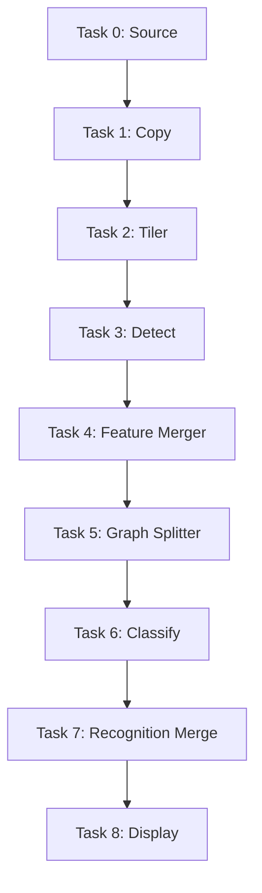
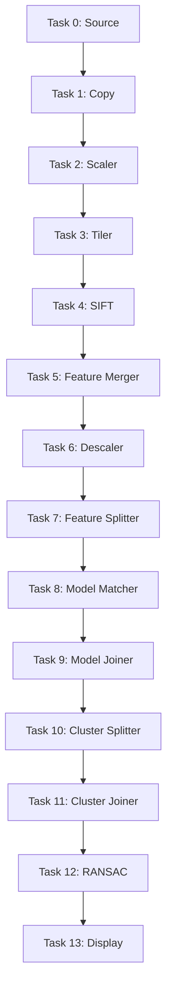
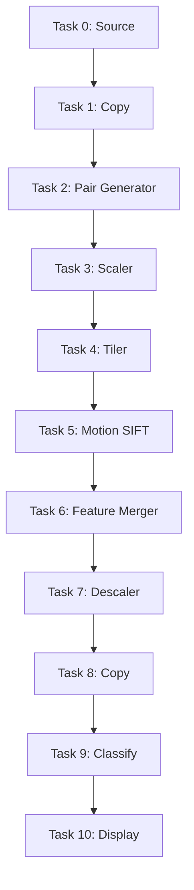

## Common Environment Setup

```python
from core.network import Network, Node
from core.environment import Environment
from core.workflow import Workflow, Task
from agents.workflow import run_workflow

# Common network structure for all examples
network = Network()
network.add_node(Node(0, 'edge', compute_power=10e9, energy_coeff=0.5))
network.add_node(Node(1, 'cloud', compute_power=50e9, energy_coeff=0.2))
network.add_link(0, 1, bandwidth=10e6, delay=0.01)
network.add_link(1, 0, bandwidth=10e6, delay=0.01)
network.add_link(0, 0, bandwidth=10e6, delay=0.0)
network.add_link(1, 1, bandwidth=10e6, delay=0.0)

env = Environment(network)
env.randomize(seed=42)
```

---

## Example 1 — Face Recognition Workflow

**Description:**
A sequential pipeline for image-based face detection and classification.
Each task represents one processing stage, from data acquisition to display.

### Code Example

```python
tasks = [
    Task(0, size=4.0, dependencies={}),
    Task(1, size=6.0, dependencies={0: 2.0}),
    Task(2, size=8.0, dependencies={1: 1.0}),
    Task(3, size=10.0, dependencies={2: 1.0}),
    Task(4, size=6.0, dependencies={3: 1.0}),
    Task(5, size=5.0, dependencies={4: 1.0}),
    Task(6, size=5.0, dependencies={5: 1.0}),
    Task(7, size=3.0, dependencies={6: 1.0}),
    Task(8, size=2.0, dependencies={7: 0.5})
]
wf = Workflow(tasks)

result = run_workflow("Face Recognition Offloading", {
    "env": env.get_all_parameters(),
    "workflow": wf.to_dict(),
    "params": {"CT": 0.2, "CE": 1.34, "delta_t": 1, "delta_e": 1}
})
```

### DAG Visualization



---

## Example 2 — Object Recognition Workflow

**Description:**
A multi-stage object recognition process involving feature extraction, matching, and clustering.

### Code Example

```python
tasks = [
    Task(0, size=5.0, dependencies={}),
    Task(1, size=6.0, dependencies={0: 1.0}),
    Task(2, size=6.0, dependencies={1: 1.0}),
    Task(3, size=8.0, dependencies={2: 1.5}),
    Task(4, size=10.0, dependencies={3: 1.0}),
    Task(5, size=7.0, dependencies={4: 1.0}),
    Task(6, size=5.0, dependencies={5: 1.0}),
    Task(7, size=6.0, dependencies={6: 1.0}),
    Task(8, size=7.0, dependencies={7: 1.0}),
    Task(9, size=5.0, dependencies={8: 1.0}),
    Task(10, size=4.0, dependencies={9: 1.0}),
    Task(11, size=4.0, dependencies={10: 1.0}),
    Task(12, size=3.0, dependencies={11: 0.5}),
    Task(13, size=2.0, dependencies={12: 0.5})
]
wf = Workflow(tasks)

result = run_workflow("Object Recognition Offloading", {
    "env": env.get_all_parameters(),
    "workflow": wf.to_dict(),
    "params": {"CT": 0.2, "CE": 1.34, "delta_t": 1, "delta_e": 1}
})
```

### DAG Visualization



---

## Example 3 — Gesture Recognition Workflow

**Description:**
A temporal data pipeline for recognizing gestures through motion-based SIFT features and classification.

### Code Example

```python
tasks = [
    Task(0, size=4.0, dependencies={}),
    Task(1, size=6.0, dependencies={0: 1.0}),
    Task(2, size=6.0, dependencies={1: 1.0}),
    Task(3, size=7.0, dependencies={2: 1.0}),
    Task(4, size=8.0, dependencies={3: 1.0}),
    Task(5, size=10.0, dependencies={4: 1.0}),
    Task(6, size=6.0, dependencies={5: 1.0}),
    Task(7, size=5.0, dependencies={6: 1.0}),
    Task(8, size=4.0, dependencies={7: 0.5}),
    Task(9, size=5.0, dependencies={8: 0.5}),
    Task(10, size=3.0, dependencies={9: 0.5})
]
wf = Workflow(tasks)

result = run_workflow("Gesture Recognition Offloading", {
    "env": env.get_all_parameters(),
    "workflow": wf.to_dict(),
    "params": {"CT": 0.2, "CE": 1.34, "delta_t": 1, "delta_e": 1}
})
```

### DAG Visualization


